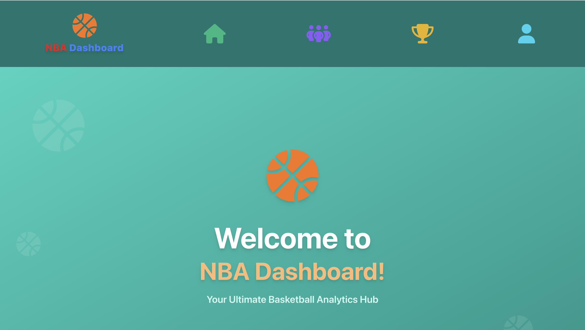
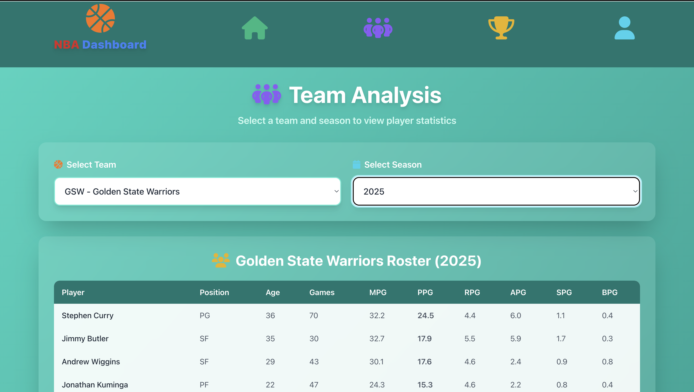
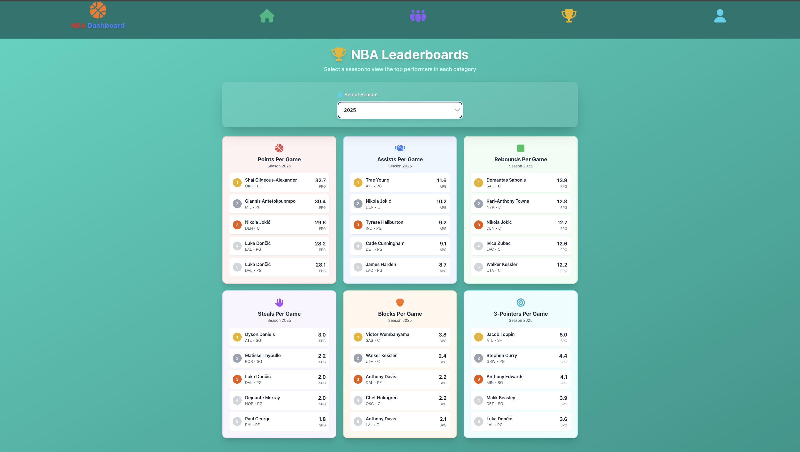
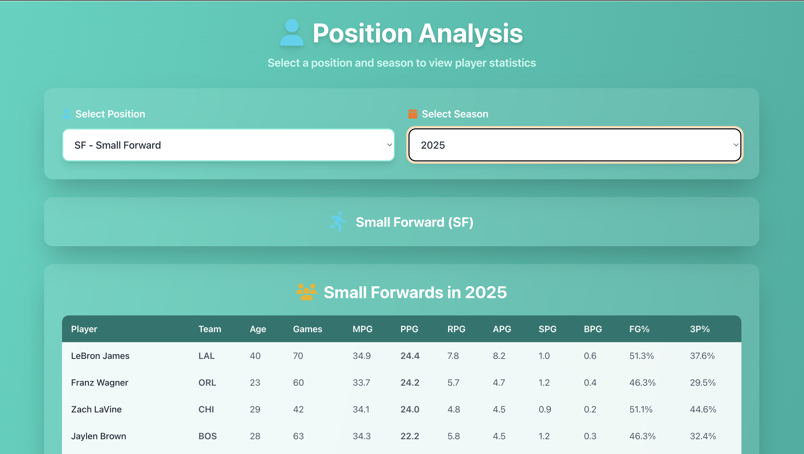

# NBA Dashboard - Full-Stack Basketball Analytics Platform

## Project Overview

A comprehensive fullstack web application that provides NBA player statistics and team analysis. Built with React frontend and Spring Boot backend, this dashboard offers interactive data visualization and filtering capabilities for basketball enthusiasts, analysts, and team management.

## NBA Dashboard Visuallization

- Home page


- Team page


- Leaderboard Page


- Position Page


## API Endpoints

### **Player Data**

- `GET /nba` - Retrieve players with optional filters (team, season, position)
- `GET /nba/leaderboard/points` - Top scorers by season
- `GET /nba/leaderboard/assists` - Top assist leaders
- `GET /nba/leaderboard/rebounds` - Top rebounders
- `GET /nba/leaderboard/steals` - Top steal leaders
- `GET /nba/leaderboard/blocks` - Top shot blockers
- `GET /nba/leaderboard/threepoints` - Top 3-point shooters
- `GET /nba/leaderboard/all` - Complete leaderboard data


## Development Setup

### **Prerequisites**

- Java 21+
- Node.js 18+
- PostgreSQL 17+
- Maven 3.6+

### **Backend Setup**

```bash
cd Backend/dashboard
./mvnw spring-boot:run
```

### **Frontend Setup**

```bash
cd frontend
npm install
npm run dev
```

---

**Technologies Used**: Docker, React, Spring Boot, PostgreSQL, JavaScript, Java, Tailwind CSS, Python, Data Analysis
